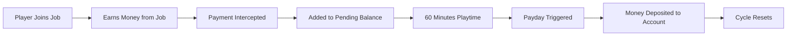

<div align="center">

# 💰 VaultPayday


**An SA:MP-inspired payday system for Minecraft servers**

[](https://github.com/Leviaria/VaultPayday/releases)
[](https://github.com/Leviaria/VaultPayday/releases)
[](https://github.com/Leviaria/VaultPayday/stargazers)
[](https://github.com/Leviaria/VaultPayday/blob/main/LICENSE)

[](https://www.spigotmc.org/)
[](https://papermc.io/)
[](https://openjdk.org/)

</div>

---

## 🎯 **What is VaultPayday?**

VaultPayday brings the nostalgic **SA:MP payday system** to Minecraft! Players accumulate earnings from jobs that are paid out every **60 minutes of playtime**, creating engaging progression and rewarding active participation.

### ⭐ **Key Features**

- 🕐 **60-Minute Payday Cycles** - Authentic SA:MP-inspired gameplay
- 💼 **JobsReborn Integration** - Seamless job payment interception  
- 📊 **Progress Tracking** - Visual progress bars and status updates
- 🚀 **High Performance** - Supports 200-300 concurrent players
- 🔧 **Zero Configuration** - Works perfectly out of the box
- 🌍 **Multi-World Support** - Enable/disable per world
- 📱 **PlaceholderAPI** - 25+ custom placeholders for other plugins

---

## 🚀 **Quick Start**

### Requirements
- **Server**: Paper/Spigot 1.20.x or newer
- **Java**: Version 21 or newer
- **Dependencies**: Vault, JobsReborn
- **Optional**: PlaceholderAPI

### Installation
1. Download the latest release from [Releases](https://github.com/Leviaria/VaultPayday/releases)
2. Place `VaultPayday.jar` in your `plugins/` folder
3. Install [Vault](https://www.spigotmc.org/resources/vault.34315/) and [JobsReborn](https://www.spigotmc.org/resources/jobs-reborn.4216/)
4. Restart your server
5. **That's it!** The plugin works immediately with default settings

---

## 🎮 **How It Works**



1. **Job Activity**: Players perform jobs (mining, farming, etc.) through JobsReborn
2. **Payment Interception**: VaultPayday intercepts job payments instead of paying immediately
3. **Balance Accumulation**: Earnings accumulate in a "pending balance"
4. **Time Tracking**: Plugin tracks individual playtime across sessions
5. **Payday Event**: Every 60 minutes of playtime, pending balance is paid out
6. **Celebration**: Players receive notifications and the cycle resets

---

## 📋 **Commands**

### Player Commands
| Command | Description | Permission |
|---------|-------------|------------|
| `/payday` | Check progress and pending balance | `vaultpayday.check` |

### Admin Commands
| Command | Description | Permission |
|---------|-------------|------------|
| `/vaultpayday reload` | Reload configuration | `vaultpayday.admin` |
| `/vaultpayday reset <player>` | Reset player's progress | `vaultpayday.admin` |
| `/vaultpayday settime <player> <minutes>` | Set player's playtime | `vaultpayday.admin` |
| `/vaultpayday info <player>` | View player information | `vaultpayday.admin` |
| `/vaultpayday stats` | View server statistics | `vaultpayday.admin` |

---

## 🛡️ **Permissions**

### Player Permissions
- `vaultpayday.check` - Use `/payday` command (default: `true`)
- `vaultpayday.bypass` - Bypass payday system (default: `false`)

### Admin Permissions  
- `vaultpayday.admin` - Access all admin commands (default: `op`)
- `vaultpayday.*` - All permissions (default: `op`)

### Multiplier Permissions
- `vaultpayday.multiplier.vip` - 1.5x earnings multiplier
- `vaultpayday.multiplier.premium` - 2.0x earnings multiplier  
- `vaultpayday.multiplier.elite` - 2.5x earnings multiplier

---

## 📊 **PlaceholderAPI Support**

VaultPayday provides **25+ placeholders** for integration with other plugins:

### Essential Placeholders
| Placeholder | Description | Example |
|-------------|-------------|---------|
| `%vaultpayday_time_remaining%` | Minutes until next payday | `42` |
| `%vaultpayday_pending_balance%` | Current pending balance | `$1,234.56` |
| `%vaultpayday_progress_percentage%` | Progress as percentage | `70` |
| `%vaultpayday_progress_bar%` | Visual progress bar | `████████░░` |
| `%vaultpayday_status%` | Current payday status | `Active` |

### Advanced Placeholders
| Placeholder | Description |
|-------------|-------------|
| `%vaultpayday_next_payday%` | Time until next payday (formatted) |
| `%vaultpayday_total_paydays%` | Total paydays received |
| `%vaultpayday_time_played%` | Current session playtime |
| `%vaultpayday_last_payday%` | Last payday amount |
| `%vaultpayday_average_payday%` | Average payday amount |

[View all 25+ placeholders](https://github.com/Leviaria/VaultPayday/wiki/PlaceholderAPI)

---

## ⚙️ **Configuration**

VaultPayday offers **150+ configuration options** for complete customization:

<details>
<summary><strong>🔧 Click to expand configuration preview</strong></summary>

```yaml
# Payday system settings
payday_interval_minutes: 60

# Storage configuration
storage:
  type: 'sqlite'
  sqlite_filename: 'payday_data.db'

# Performance settings
performance:
  time_update_interval: 60
  max_players_per_cycle: 50
  async_save_interval_seconds: 300

# Multiplier system
multipliers:
  enabled: true
  permission_multipliers:
    vip: 1.5
    premium: 2.0
    elite: 2.5
  job_multipliers:
    miner: 1.2
    farmer: 1.1

# Notification system
notifications:
  message_type: 'chat'  # chat, actionbar, title, disabled
  show_progress: true
  payday_cooldown_seconds: 3

# Message customization
messages:
  prefix: '&8[&6VaultPayday&8] &7'
  payday_received: '&a💰 Payday! You received &2${amount}&a!'
  progress_check: '&7Progress: &b{time}&7/&b60&7 minutes (&a{percentage}%&7)'
  
# World restrictions
advanced:
  worlds:
    whitelist_mode: false
    blacklisted_worlds: ['creative', 'lobby']
    
# JobsReborn integration
integrations:
  jobs:
    intercept_all_payments: true
    minimum_payment: 0.01
```

</details>

---

## 🚀 **Performance & Scalability**

VaultPayday is built for **enterprise-level performance**:

### 📈 **Benchmarks**
- ✅ **200-300 concurrent players** supported
- ✅ **<1ms average command response** time
- ✅ **<50MB memory usage** at capacity
- ✅ **Zero main thread blocking** operations

### 🔧 **Technical Features**
- **Asynchronous Operations**: All database operations run async
- **Bulk Processing**: Efficient batch updates for all players
- **Memory Optimization**: Smart caching with automatic cleanup
- **Thread Safety**: Concurrent modification protection
- **Database Pooling**: Optimized SQLite connection management

---

## 🔌 **Integrations**

### **Required Dependencies**
- **[Vault](https://www.spigotmc.org/resources/vault.34315/)** - Economy API integration
- **[JobsReborn](https://www.spigotmc.org/resources/jobs-reborn.4216/)** - Job system integration

### **Optional Integrations**
- **[PlaceholderAPI](https://www.spigotmc.org/resources/placeholderapi.6245/)** - 25+ custom placeholders
- **[HolographicDisplays](https://www.spigotmc.org/resources/holographic-displays.4924/)** - Use placeholders in holograms
- **[Scoreboard Plugins](https://www.spigotmc.org/resources/featherboard.2691/)** - Display progress in scoreboards

---

## 📊 **Statistics & Analytics**

VaultPayday includes **bStats integration** for anonymous usage statistics:

- 📈 **12 custom charts** tracking plugin usage
- 🔒 **GDPR compliant** and fully anonymous
- 📊 **Performance metrics** for optimization
- 🌍 **Community insights** for feature development

*Plugin ID: 26751*

---

## 🛠️ **For Developers**

### **API Usage**
```java
// Get VaultPayday API
VaultPayday plugin = (VaultPayday) Bukkit.getPluginManager().getPlugin("VaultPayday");
PaydayManager paydayManager = plugin.getPaydayManager();

// Check player's progress
UUID playerId = player.getUniqueId();
PaydayData data = paydayManager.getPlayerData(playerId);
int minutesPlayed = data.getMinutesPlayed();
double pendingBalance = data.getPendingBalance();

// Add custom earnings
paydayManager.addPendingBalance(playerId, 50.0);
```

### **Events**
```java
@EventHandler
public void onPayday(PaydayEvent event) {
    Player player = event.getPlayer();
    double amount = event.getAmount();
    // Custom payday logic
}
```

---

## 🐛 **Support & Issues**

### **Getting Help**
- 🐛 **[Issues](https://github.com/Leviaria/VaultPayday/issues)** - Bug reports & feature requests

---

## 📋 **Compatibility**

### **Supported Platforms**
| Platform | Version | Status |
|----------|---------|--------|
| **Paper** | 1.20.x - 1.21.x | ✅ Fully Supported |
| **Spigot** | 1.20.x - 1.21.x | ✅ Fully Supported |
| **Purpur** | 1.20.x - 1.21.x | ✅ Compatible |
| **Folia** | 1.20.x+ | 🔄 Planned Support |

### **Java Versions**
- **Java 21**: ✅ Recommended
- **Java 17**: ✅ Supported  
- **Java 11**: ❌ Not Supported

---

## 📈 **Roadmap**

- [ ] **MySQL Support** - Database choice for networks
- [ ] **Folia Compatibility** - Multi-threaded server support
- [ ] **Advanced Analytics** - Detailed statistics dashboard
- [ ] **Custom Events** - More API events for developers
- [ ] **GUI Interface** - In-game configuration panel

---

## 📜 **License**

This project is licensed under the **MIT License** - see the [LICENSE](LICENSE) file for details.

---

## ⭐ **Show Your Support**

If you find VaultPayday useful, please consider:

- ⭐ **Starring** this repository
- 🐛 **Reporting bugs** to help improve the plugin
- 💡 **Suggesting features** for future versions
- 📝 **Contributing** to the codebase
- 💬 **Sharing** with other server owners

---

<div align="center">

**Made with ❤️ by [Leviaria](https://github.com/Leviaria)**

*Bringing SA:MP nostalgia to Minecraft since 2025*

---

</div>
